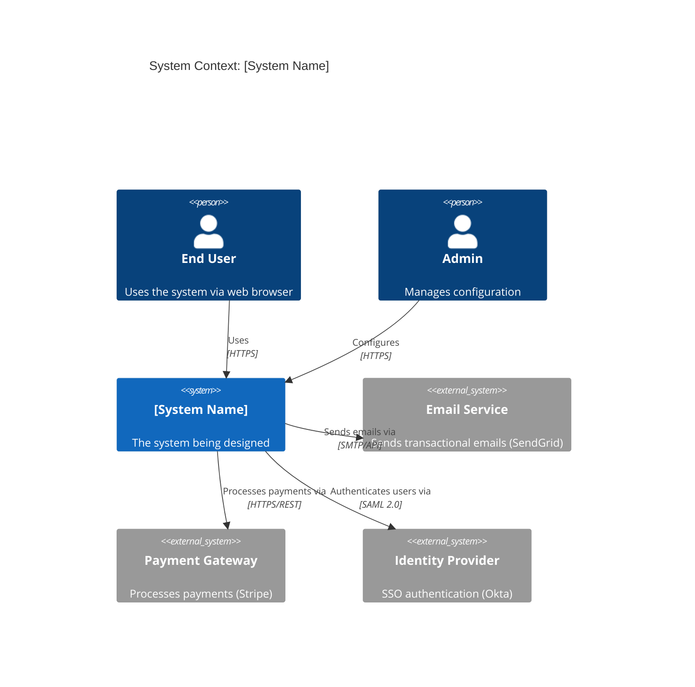
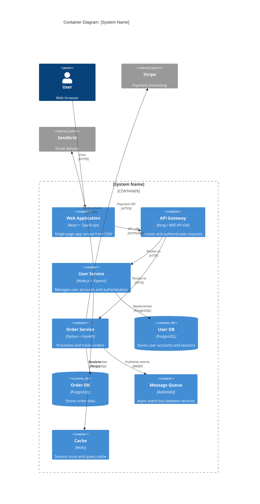
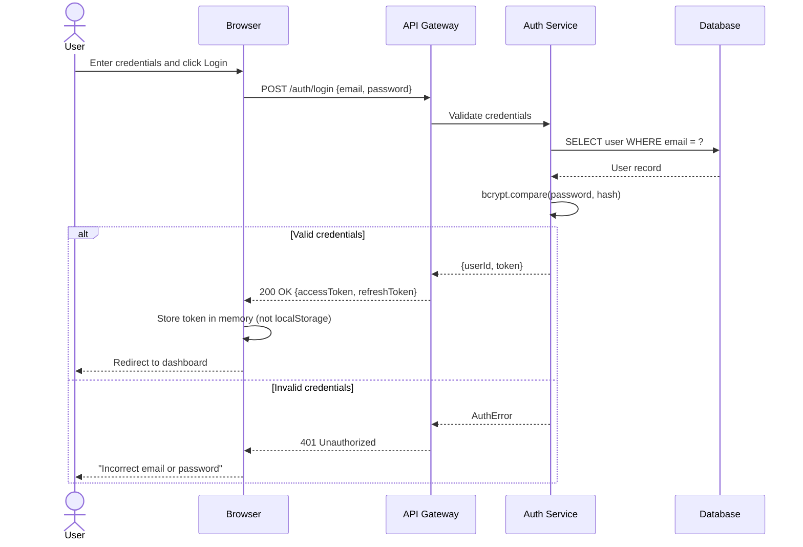
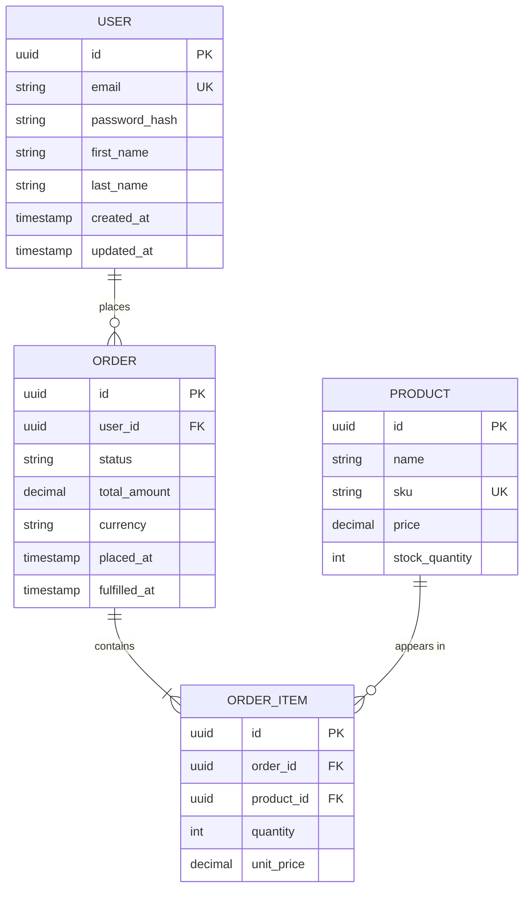
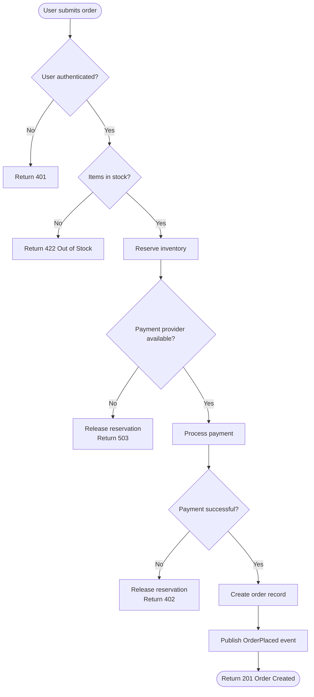
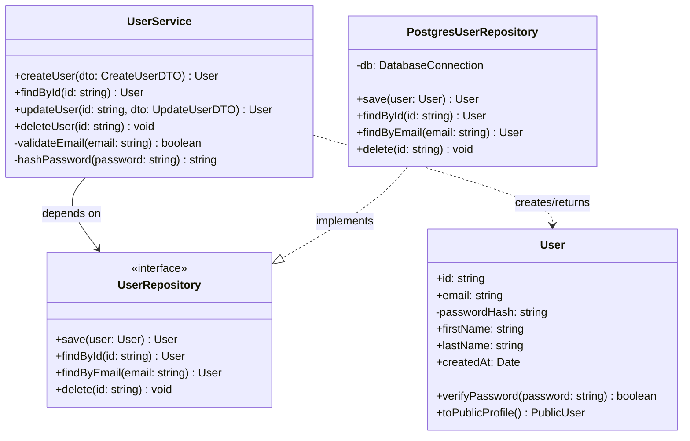
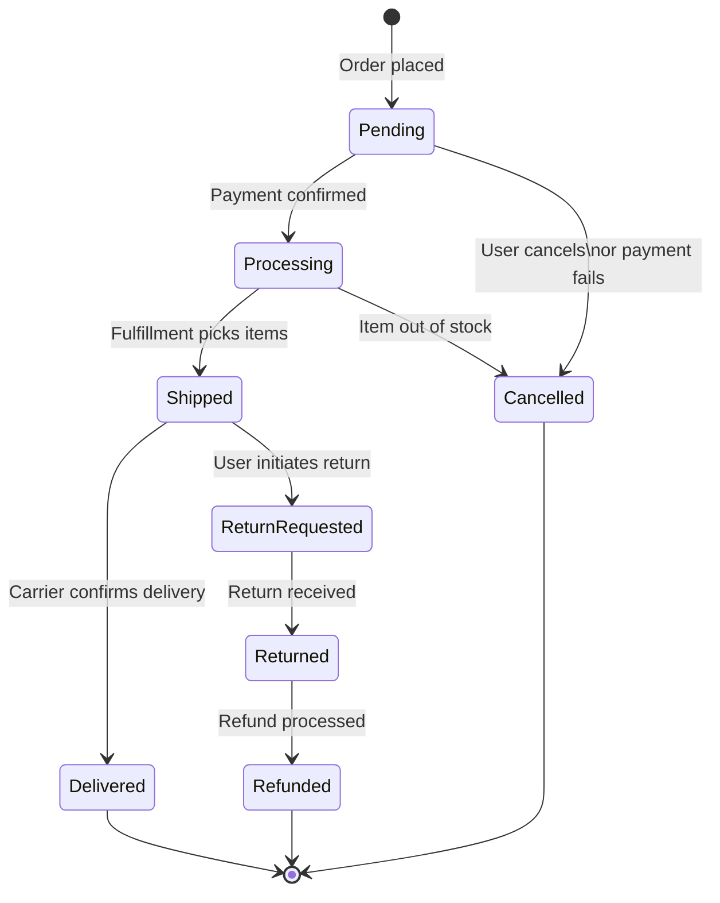

# Diagram Formats Reference

All diagrams use Mermaid syntax. Mermaid renders natively in GitHub, GitLab, Notion, Obsidian, and most documentation tools.

---

## C4 Context Diagram (System-level, external actors)

Shows: the system, its users, and external systems it depends on. Use this for executive/stakeholder communication.

---

## C4 Container Diagram (Service-level, deployment units)

Shows: the services/containers that make up the system. Use for engineering team communication.

---

## Sequence Diagram (Request flow, API interactions)

---

## ER Diagram (Data model)

---

## Flowchart (Decision flows, processes)

---

## Class Diagram (Domain model, OOP design)

---

## State Diagram (Lifecycle, status transitions)

